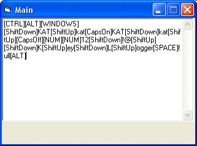



## Keylogger full

### Description

KeyLogger with all keys. Very good and easy for include in programs.
 
### More Info
 

             |
---                |---
**Submitted On**   |2001-11-04 01:23:38
**By**             |[Todor Danchev](https://github.com/Planet-Source-Code/PSCIndex/blob/master/ByAuthor/todor-danchev.md)
**Level**          |Beginner
**User Rating**    |4.7 (33 globes from 7 users)
**Compatibility**  |VB 4\.0 \(32\-bit\), VB 5\.0, VB 6\.0
**Category**       |[Complete Applications](https://github.com/Planet-Source-Code/PSCIndex/blob/master/ByCategory/complete-applications__1-27.md)
**World**          |[Visual Basic](https://github.com/Planet-Source-Code/PSCIndex/blob/master/ByWorld/visual-basic.md)
**Archive File**   |[Keylogger\_331081132001\.zip](https://github.com/Planet-Source-Code/todor-danchev-keylogger-full__1-28627/archive/master.zip)

